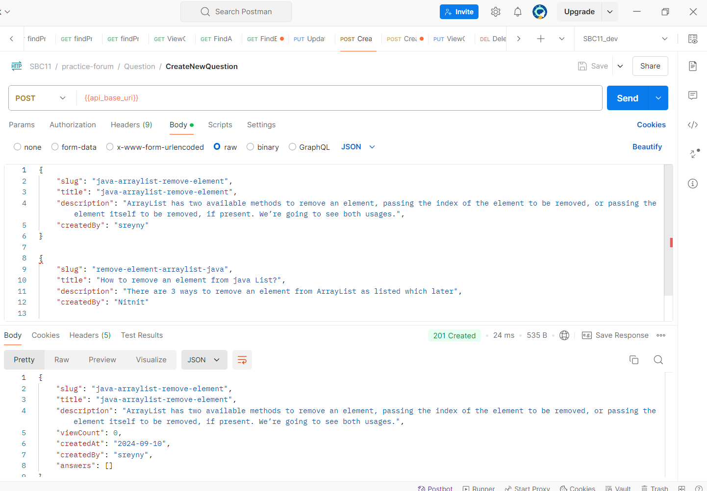
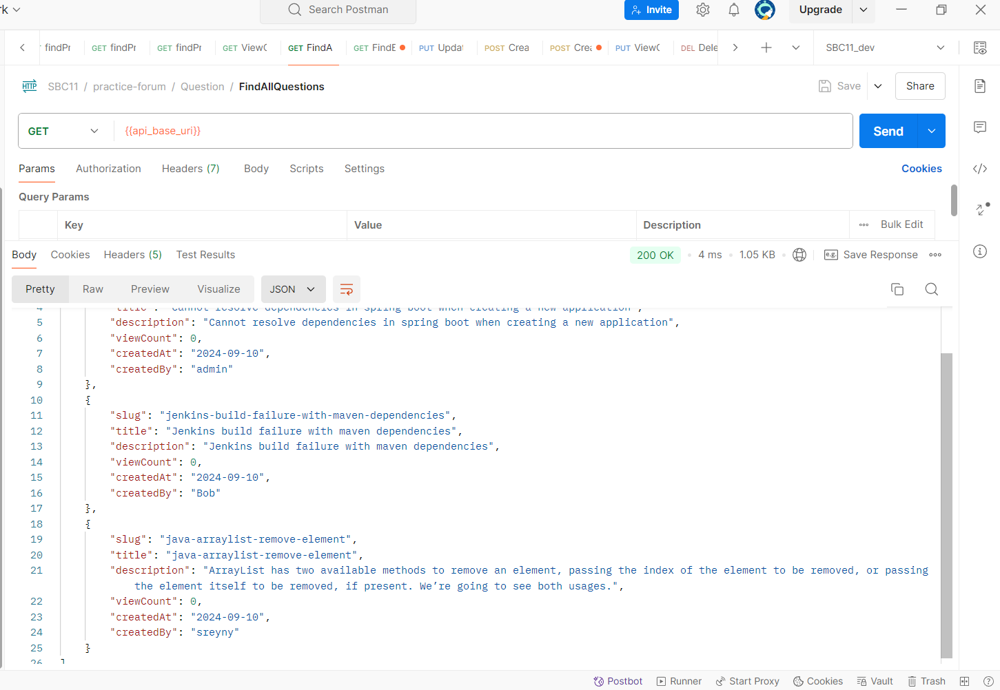
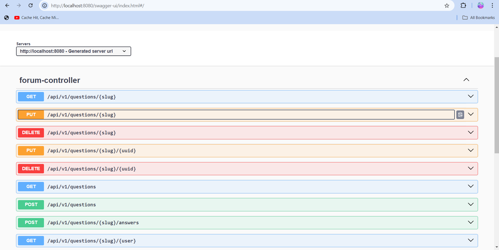

# Forum Template

Welcome to the Forum Template project! This REST API, built with Spring Boot and Spring MVC, is designed to facilitate a dynamic platform for managing questions and answers. The API allows users to add, update, and delete questions and answers, as well as search for content through various means such as by ID or slug.

## Features

- **Add Questions and Answers**: Users can create new questions and provide answers to existing ones.
- **Update Content**: Modify questions and answers to keep the information relevant.
- **Delete Content**: Remove questions and answers as needed.
- **Search Functionality**: Find questions and answers using criteria such as ID or slug.

## Technologies Used

- **Spring Boot**: Framework for building the REST API.
- **Spring MVC**: Component of Spring Boot for handling HTTP requests and responses.
- **Postman**: for testing our APIs
- JDK 21
- Note: I use static database which will be deleted when terminate the project

## Getting Started

To get started with this project, follow these steps:

1. **Clone the Repository**

   ```bash
   git clone https://github.com/your-username/forum-template.git
2. **Run the project and test on localhost port 8080**
## Test on Postman
**Example Test on postman: Create Question**
<div align=center>

</div>


**New question has been added, to conform use findAllQuestion api**


<div align=center>

</div>

## Test on Swagger
For detailed API documentation, visit the [Swagger UI](http://localhost:8080/swagger-ui/index.html).
<div align=center>

</div>


